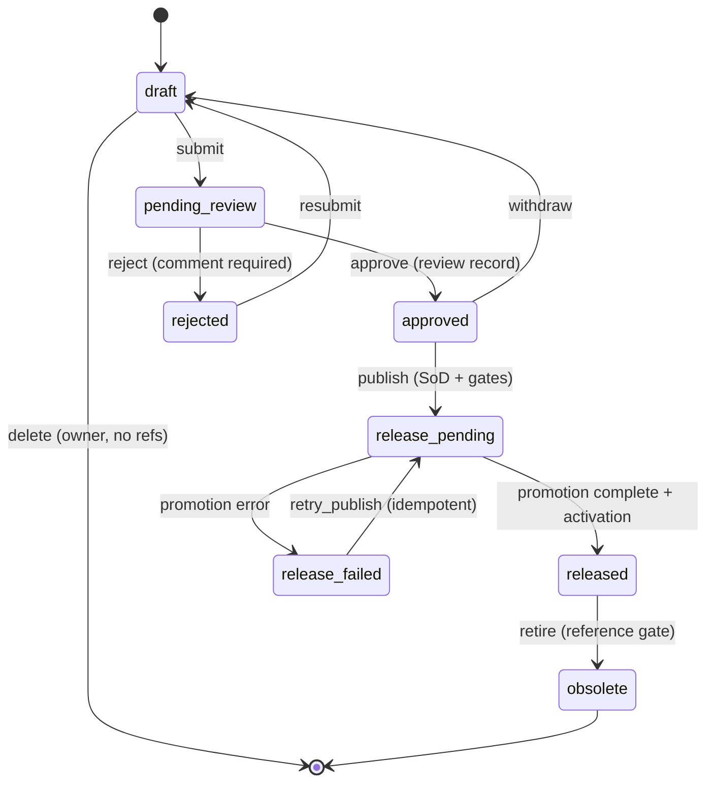

# M0 Revision 状态机

每次转移均要求 `If-Match`，非法转移返回 `409 STATE_TRANSITION_INVALID` 并回显 `current_state` 与 `allowed_actions`。发布事务锁定 Part/BOM，写入审核、ReleaseActivation、审计和效力区间；任何门禁失败保持零业务写入。`release_failed` 重试不得创建第二组发布对象。
